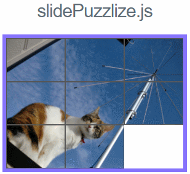

# jQuery.slidePuzzlize

## 概要


好きな画像をスライドパズル化するネタ系jqueryプラグインです。

jQuery3.x系（IE9+）に対応、IE8以下はサポート外です。

## Usage

#### index.html
```html
<!DOCTYPE html>
<html>
<head>
  <meta charset="utf-8">
  <meta http-equiv="x-ua-compatible" content="IE=Edge">
  <meta name="viewport" content="width=device-width,initial-scale=1.0,minimum-scale=1.0,maximum-scale=1.0,user-scalable=no">
  <title>jquery-slidePuzzlize</title>
</head>
<body>

  <div id="field"></div>

  <script src="http://code.jquery.com/jquery-3.2.1.min.js"></script>
  <script src="./path/to/jquery.slidePuzzlize.js"></script>
  <script src="./path/to/main.js"></script>
</body>
</html>
```

#### main.js
```js
var img = document.createElement('img');
img.src = "./assets/sample.jpg";

// initialize
var puzzle = $.slidePuzzlize({
  selector: "#field", // パズルのコンテナとなる要素（省略可）
});

// 画像の適用
puzzle.setImage(img)
.then(function() {

  // シャッフルする
  this.shuffle();
});
```

## API

### Options (Properties)
基本的にどれも省略可能

Name | Type | Info
--- | --- | ---
selector | String | パズル化する要素セレクタ（#id or .class）を指定
col | Number | パズルの行数を設定
row | Number | パズルの段数を設定
enableAnimation | Boolean | スライド時のアニメーションを許可するかどうかを設定
animateDuration | Number | スライドアニメーションのスピードを設定
pieceOpacity | Number | マッチしていないピースの透明度を設定 （0 ~ 1）
shuffleStrength | Number | シャッフル強度を設定、高いほど回数が増加（初期値：16）

…TODO

### Methods
一部を除き、自分自身を返します。(つまりメソッドチェーン化できます)

#### shuffle()
パズルをシャッフルします。

#### setGrid(rowNumber, colNumber)
パズルの行数・列数を変更します。

#### setImage(imageSrc || imgElement)
画像を適用します。  
非同期処理のため、これだけはpromiseを返すことに注意。  
引数として適用したimg要素を受け取ることも出来ます。

```js
// 画像セット直後にシャッフルしたい場合
var img = "./assets/image/cat.jpg"
var puzzle = $.slidePuzzlize();

puzzle.setImage(img)
.then(function(img) {
  // コンテキストは維持されるので this === puzzle となります
  this.resize(img.width/2, img.height/2); // 画像に合わせてサイズ変更
  
  // パズルをシャッフル：
  this.shuffle();
});

```

#### resize(width, height)
パズル全体のサイズを変更し、reset()を行います。

#### reset()
パズルを直近のシャッフル直後の状態にリセットします。

### Events
特定動作に応じて各種イベントを発火します。

#### shuffle
シャッフル完了時に発火

#### pieceMove
ピース移動時に発火

#### match
パズルが揃った時に発火

```js
var img = "./assets/image/cat.jpg";
var puzzle = $.slidePuzzlize({});

puzzle.setImage(img)
.then(function(img) {
  this.shuffle();

  // 揃った時に"clear!"と表示
  this.on("match", function() {
    console.log('clear!')
  });
});

```

## Licence

[MIT](https://opensource.org/licenses/MIT)

## Author

[pentamania](https://github.com/pentamania)